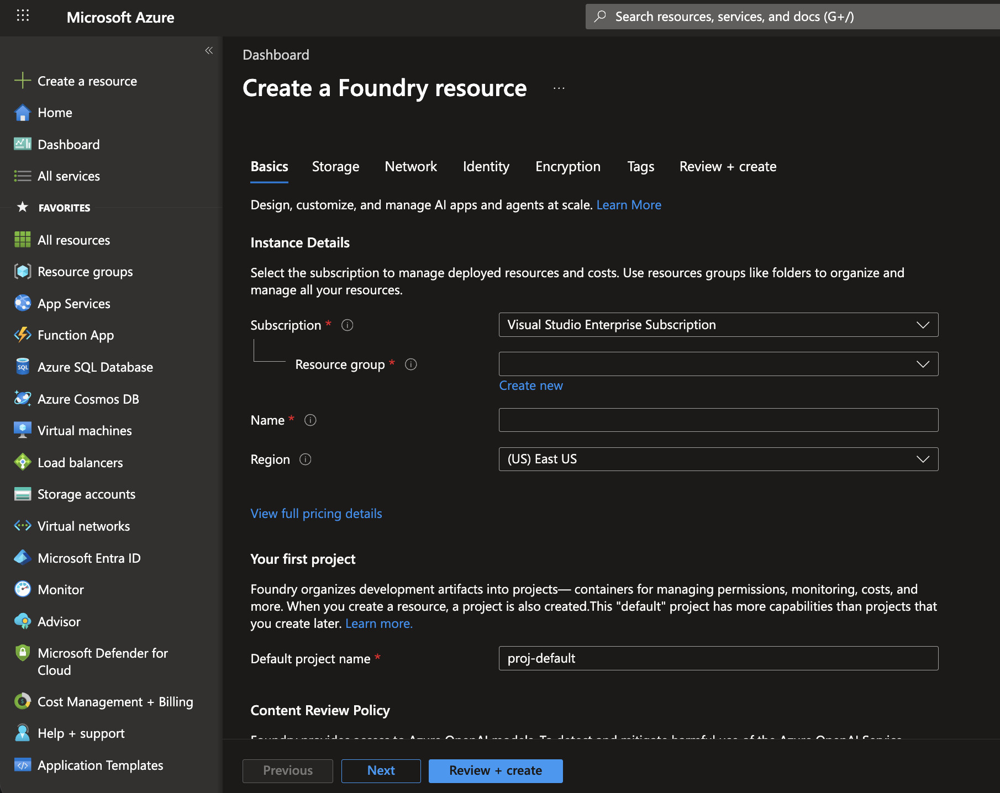
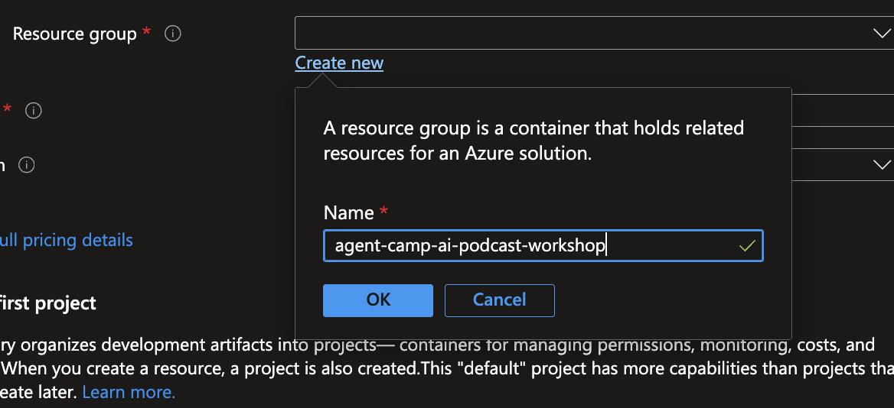
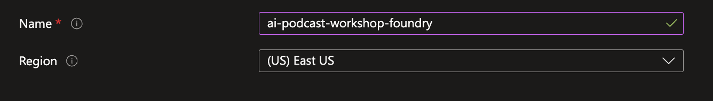
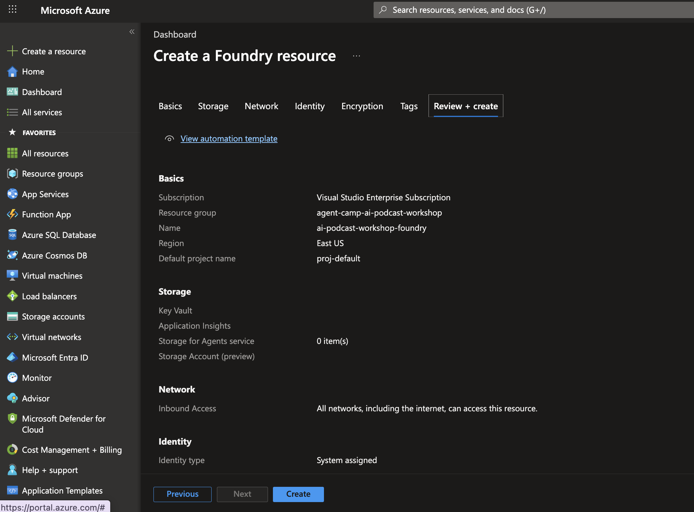
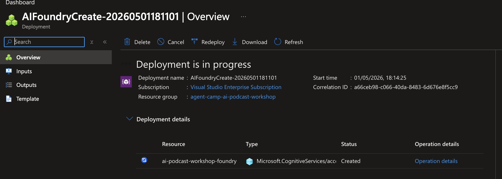
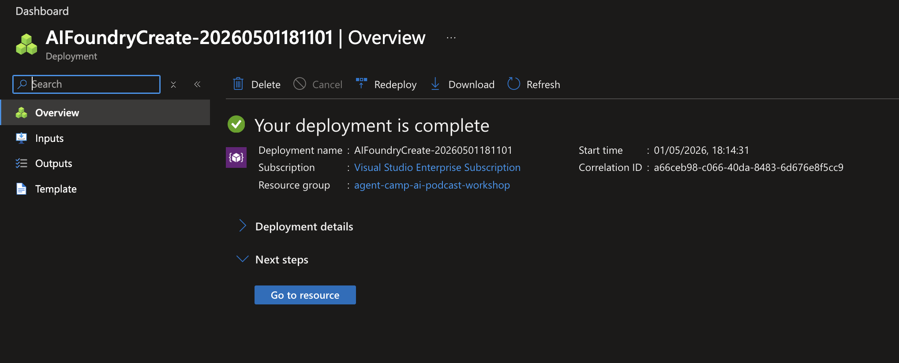
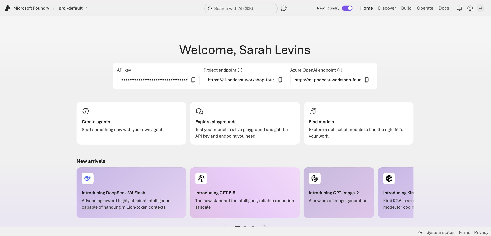
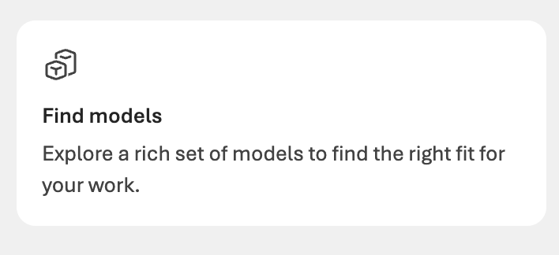
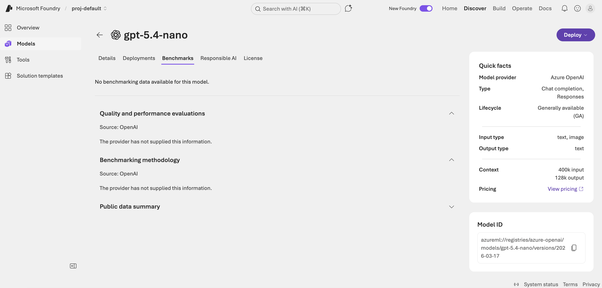

# Set up Azure AI Foundry

This guide walks you through creating an Azure AI Foundry resource, deploying a model, and collecting the three values you need for your workshop `.env`:

- `FOUNDRY_PROJECT_ENDPOINT`
- `FOUNDRY_API_KEY`
- `FOUNDRY_MODEL`

You'll need an active **Azure subscription**. Costs may apply depending on your subscription and the model you choose.

---

## 1. Open the "Create a Foundry resource" page

In the Azure Portal, go to [Create a Foundry resource](https://portal.azure.com/#view/Microsoft_Azure_ProjectOxford/AIFoundryCreate_Dx/dxParameters~/%7B%7D).

## 2. Select your subscription

Choose the Azure subscription you want the resource to be billed against.



## 3. Create a new resource group

Create a fresh resource group dedicated to this workshop — it makes cleanup easy when you're done.



## 4. Name the resource and pick a region

Give your Foundry resource a name and set the location to **(US) East US**.



## 5. Review and create

Click **Review + Create**. Azure will run final validation for a few moments. Once it passes, review the configuration and click **Create**.



## 6. Wait for deployment

Azure will provision the resource — this typically takes a few minutes.



## 7. Open the Foundry portal

When the deployment finishes, click **Go to resource**, then click **Go to the Foundry portal**.



## 8. Copy your API key and project endpoint

In the Foundry portal you'll see an **API Key** and a **Project endpoint**. Copy these into your workshop `.env`:

```env
FOUNDRY_API_KEY=<your-api-key>
FOUNDRY_PROJECT_ENDPOINT=<your-project-endpoint>
```



> Treat the API key like a password — don't commit it to git. The repo's `.gitignore` already excludes `.env`.

## 9. Find a model to deploy

In the Foundry portal, click **Find models**.



## 10. Deploy your chosen model

Pick a model that fits your subscription's pricing and quota. Larger models are more capable but cost more and take longer to deploy.

For this workshop we recommend **`gpt-5.4-nano`**:

1. Search for `gpt-5.4-nano`
2. Select it
3. Click the **Deploy** button in the top-right
4. When the dropdown appears, choose **Default settings**



## 11. Set `FOUNDRY_MODEL` in your `.env`

Once your model is successfully deployed, add the model name to your `.env`:

```env
FOUNDRY_MODEL=gpt-5.4-nano
```

---

You're all set. Head back to [Environment Setup Step 2](../README.md#2-choose-and-configure-your-model-provider) to finish wiring up your environment, or jump straight to the [setup test notebook](../setup-test.ipynb) to verify everything works.
