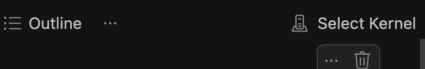
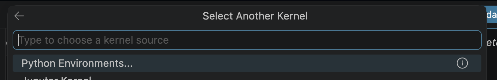
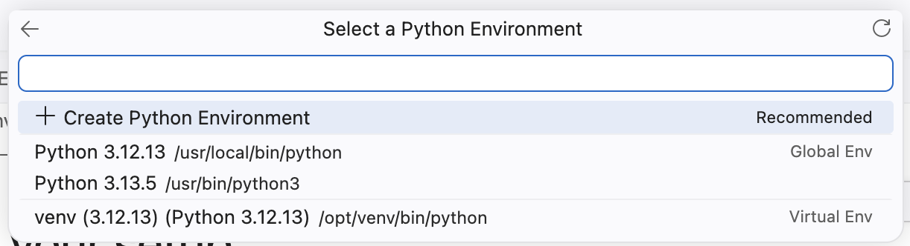

# Environment Setup (15 minutes)

### 1. Choose an environment

| Option | Description | Requirements | Setup Steps |
|--------|-------------|--------------|--------------|
| **Codespace  (recommended for live/in-person workshop)** | Pre-built environment with code and models pre-installed. Just open and go. | GitHub account. GitHub spend may apply. | [Github Codespace](content/1-Environment_setup/setup/codespace.md) |
| **Local** | Fork and clone this repo, Open in VS Code in dev container or install requirements locally | Python 3.10+, Azure subscription | [Local](content/1-Environment_setup/setup/local.md) |

### 2. Choose a model provider

We'll be running agents via notebooks and scripts through the agent-framework, which supports several model providers. Pick the one that matches your setup:

| Provider | When to use it | Speed | `MODEL_PROVIDER` | What to configure in .env | Set up instuctions |
|----------|----------------|-------|------------------|---------------------------|-------------------|
| **Azure AI Foundry  (recommended for live/in-person workshop)** | You have an Azure subscription and a deployed model. Best performance and the most production-like experience. | Fastest | `foundry` | `FOUNDRY_PROJECT_ENDPOINT`, `FOUNDRY_MODEL`, `FOUNDRY_API_KEY` | [Azure AI Foundry](content/1-Environment_setup/setup/azure_ai_foundry.md) |
| **Ollama** | You have a model pulled locally, or you're using the prebuilt Codespace (models are baked in). Works fully offline but is the slowest option. | Slowest | `ollama` | `OLLAMA_HOST`, `OLLAMA_CHAT_MODEL_ID` | [Ollama](content/1-Environment_setup/setup/ollama.md) |

### 3. Test your setup

Open the [Setup Test Notebook](./setup-test.ipynb) and run some commands that sets up some agents and sends some prompts to test everything is working correctly.

When running the notebook, be sure to select the .venv as your python kernel

1. Up the top right hand corner of the notebook file, select `Select Kernel`

2. If you can't see this repo's .venv, select `Python Environments`

3. Select this repos .venv file (the one at the bottom pictured here)
