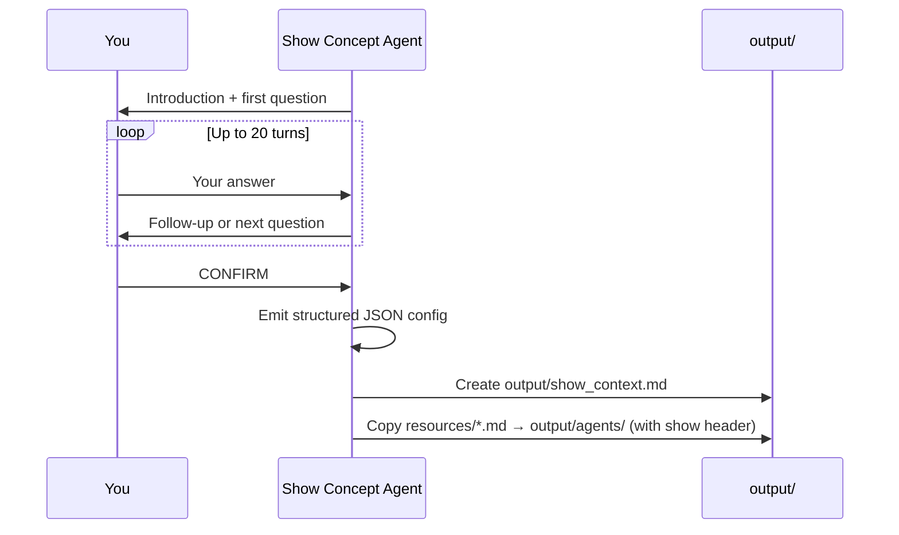
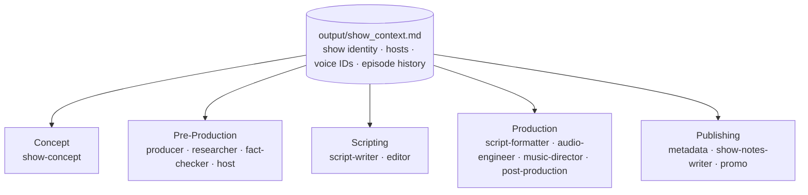

# Developing the Concept (10 minutes)

Before the pipeline can produce a single episode, it needs to know what show it's making. This section walks you through a guided conversation that captures your show concept and seeds all the agent files that every later section depends on.

## What makes a good podcast?

- **Host chemistry** — Hosts have distinct roles, not two people saying the same thing.
- **Structure** — Strong hook, clear segments, satisfying wrap-up.
- **Conversational tone** — Feels like eavesdropping on a smart conversation, not a lecture.
- **Pacing** — Mix of light moments and deep dives, varied segment lengths.
- **Complementary hosts** — One asks questions the audience would ask, the other has expertise.

## Defining host personalities

When designing an AI host, think across these dimensions:

| Dimension | Example: Curious Host | Example: Expert |
|-----------|---------------------|----------------------|
| **Role** | Asks questions, guides conversation | Provides answers, adds depth |
| **Knowledge level** | Curious beginner | Deep expertise |
| **Speaking style** | Short sentences, analogies | Structured explanations, examples |
| **Humor** | Playful, puns | Dry, deadpan |
| **Catchphrases** | "Wait, what?", "Break that down for me" | "Well actually...", "Here's the thing" |
| **Emotional range** | Excited, surprised, skeptical | Measured, occasionally passionate |
| **Conflict style** | Pushes for simpler explanations | Pushes back on oversimplification |

Good hosts **complement** each other. This tension is what makes podcasts engaging — and it's what the agents need to reproduce it in every episode.

---

## Exercise: Design your podcast concept

Run the show setup cli chat script from the repo root:

```bash
python content/2-Developing_the_concept/exercise/chat.py
```

The agent will interview you one question at a time. Answer freely in the terminal. When you're happy with the concept, type `CONFIRM` (case-insensitive) to finalize and write your config files.

**What to have ready:**
- A show name and one-line tagline
- 2 hosts with distinct personalities (aim for complementary roles — curious + expert, skeptic + storyteller)
- A target audience (be specific: not "tech people", but "engineers who manage teams")
- A tone and a few recurring segment names (Cold Open, Hot Take, Picks, etc.)
- Voice assignments — the agent will prompt you with the available options

---

## How the chat script works

The `chat.py` script runs a single **Show Concept Agent** in a streaming CLI loop. It asks one question at a time, pushes back on vague answers, and builds a complete show profile. When you type `CONFIRM`, it emits a structured JSON object and writes two things to disk: `output/show_context.md` and a show-specific header on every agent file in `output/agents/`.



The cycle guard caps the conversation at 20 turns — if you hit the limit without typing `CONFIRM`, the session finalises automatically using whatever it has collected.

---

## What the workflow produces

### `output/show_context.md`

This file is created from scratch by the workflow. Every agent in the pipeline reads it at the top of its instructions. It has four sections:

**Identity**
The show's core creative brief: name, tagline, episode format (number of hosts, episode length, release cadence), target audience, tone, and brand voice notes. Agents use this to stay on-brand — the Producer picks angles that fit the format, the Script Writer matches the tone, the Promo Agent writes copy that sounds like the show.

**Recurring Segments**
A list of the fixed sections that appear in every episode (e.g. Cold Open, Main Topic, Hot Take, Picks, Outro). The Script Writer uses this as a structural template; the Metadata and Show Notes agents use it to generate consistent chapter markers.

**Hosts**
For each host: a name, a persona description, a niche expertise area, and three voice ID assignments — one for each supported TTS provider (VibeVoice, Azure SSML, MAI-2). The persona and niche feed into every agent that writes or edits dialogue; the voice IDs are used by the Script Formatter and Audio Engineer when rendering audio.

```
### Jason
- **Persona:** The louder, hype-driven theory gremlin — fast jokes, big reactions
- **Niche:** Theory synthesis and spotting narrative patterns across seasons
- **Voice IDs:**
  - vibevoice: Carter
  - mai2: en-US-Liam:MAI-Voice-2
```

**Episode History**
Empty at first. After each episode run, a summary is appended here. The Producer reads this section to avoid repeating topics and to find opportunities for callbacks to past episodes.

---

### `output/agents/*.md`

These 13 files are **copied and stamped** from the templates in [`exercise/resources/`](exercise/resources/). The templates are generic — they contain no show-specific information. The workflow copies each one into `output/agents/` and prepends a one-line show header (`_This agent serves the **Show Name** podcast. Show details are in output/show_context.md._`). That header is what binds each generic agent definition to your specific show. The `output/agents/` directory is entirely generated — re-running the workflow overwrites it cleanly from the templates.

| File | Role |
|------|------|
| `producer.md` | Creates the episode angle, title, one-sentence hook, and 3–5 escalating talking points with host assignments |
| `researcher.md` | Gathers facts, stats, examples, and quotes for each talking point; flags contested or surprising claims |
| `fact-checker.md` | Reviews the Researcher's output for dubious, overstated, or unverifiable claims before they reach the script |
| `host.md` | Provides each host's personal angle, niche examples, hot take, reactions to talking points, and a picks recommendation |
| `script-writer.md` | Turns the Producer's outline and research into a full multi-speaker dialogue script with structure and inflection cues |
| `editor.md` | Tightens pacing, sharpens host voice consistency, checks read-aloud feel, and issues an APPROVED or REVISE signal |
| `script-formatter.md` | Converts the approved script to the format required by the chosen TTS backend (VibeVoice, Azure SSML, or MAI-2) |
| `audio-engineer.md` | Generates episode audio via the chosen TTS provider, or gives precise manual instructions if running locally |
| `music-director.md` | Selects background music, stings, and transition cues (defined but not yet wired into the workflow) |
| `post-production.md` | Builds the assembly plan for mixing audio segments into a final episode file |
| `metadata.md` | Generates the episode slug, SEO title, short/long descriptions, tags, and estimated chapter markers |
| `show-notes-writer.md` | Writes the listener-facing episode description (150–200 words) and formatted chapter list |
| `promo.md` | Creates social media posts for Twitter/X and LinkedIn |

---

### How agents use `show_context.md`

Every agent file starts with a link back to `show_context.md`. The context isn't repeated inside each agent — it's a single source of truth that all stages read at runtime.



This means editing `show_context.md` after the fact has real effects — update the brand voice notes or add a new recurring segment and all agents pick it up on the next run.

---

Once `output/show_context.md` exists and the agents directory is seeded, you're ready for Section 3.
