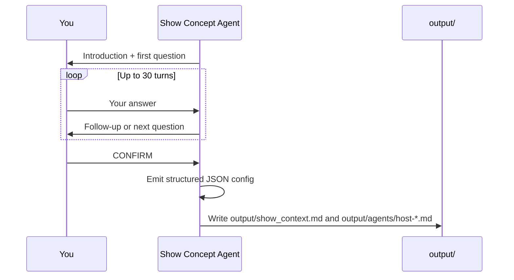
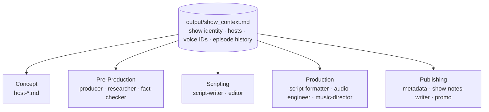

# Developing the Concept (10 minutes)

Before the pipeline can produce a single episode, it needs to know what show it's making. This section sets you up with an Agent designed to help you come up with all the artifacts you need for your show.

## What makes a good podcast?

- **Host chemistry** — Hosts have distinct roles, not two people saying the same thing.
- **Structure** — Strong hook, clear segments, satisfying wrap-up.
- **Conversational tone** — Feels like eavesdropping on a smart conversation, not a lecture.
- **Pacing** — Mix of light moments and deep dives, varied segment lengths.
- **Complementary hosts** — One asks questions the audience would ask, the other has expertise.

## Defining host personalities

When designing an AI host, think across these dimensions:

| Dimension | Example: Curious Host | Example: Expert |
|-----------|---------------------|----------------------|
| **Role** | Asks questions, guides conversation | Provides answers, adds depth |
| **Knowledge level** | Curious beginner | Deep expertise |
| **Opinions** | Hosts have strong and consistent opinions they voice, which carry on episode to episode and evolve over time |
| **Speaking style** | Short sentences, analogies | Structured explanations, examples |
| **Humor** | Playful, puns | Dry, deadpan |
| **Catchphrases** | "Wait, what?", "Break that down for me" | "Well actually...", "Here's the thing" |
| **Emotional range** | Excited, surprised, skeptical | Measured, occasionally passionate |
| **Conflict style** | Pushes for simpler explanations | Pushes back on oversimplification |

Good hosts **complement** each other. This tension is what makes podcasts engaging — and it's what the agents need to reproduce it in every episode.

---

## Exercise 1: Design your podcast concept

Run the show setup CLI chat script from the repo root:

```bash
python content/2-Developing_the_concept/exercise-1/chat.py
```

The agent will interview you one question at a time. Answer freely in the terminal. When you're happy with the concept, type `CONFIRM` (case-insensitive) to finalize and write your config files.

**What to have ready:**
- A show name and one-line tagline
- 2 hosts with distinct personalities (aim for complementary roles — curious + expert, skeptic + storyteller)
- A target audience (be specific: not "tech people", but "engineers who manage teams")
- A tone and a few recurring segment names (Cold Open, Hot Take, Picks, etc.)
- Voice assignments — the agent will suggest options from the available voices and ask you to listen to samples before confirming

---

## How the chat script works

The `chat.py` script runs a single **Show Concept Agent** in a streaming CLI loop. It asks one question at a time, pushes back on vague answers, and builds a complete show profile — including rich host personalities with opinions, quirks, and catchphrases. When you type `CONFIRM`, it emits a structured JSON object and writes your config files to disk.



The cycle guard caps the conversation at 30 turns — if you hit the limit without typing `CONFIRM`, the session finalises automatically using whatever it has collected.

---

## What the workflow produces

### `output/show_context.md`

This file is created from scratch by the workflow. Every agent in the pipeline reads it at the top of its instructions. It has four sections:

**Identity**
The show's core creative brief: name, tagline, episode format (number of hosts, episode length, release cadence), target audience, tone, and brand voice notes. Agents use this to stay on-brand — the Producer picks angles that fit the format, the Script Writer matches the tone, the Promo Agent writes copy that sounds like the show.

**Recurring Segments**
A list of the fixed sections that appear in every episode (e.g. Cold Open, Main Topic, Hot Take, Picks, Outro). The Script Writer uses this as a structural template; the Metadata and Show Notes agents use it to generate consistent chapter markers.

**Hosts**
For each host: a name, persona, niche expertise, background story, strong opinions, speech quirks, catchphrases, and voice ID assignments for each supported TTS provider (VibeVoice and MAI-2). The persona and niche feed into every agent that writes or edits dialogue; the voice IDs are used when rendering audio.

```
### Jason
- **Persona:** The louder, hype-driven theory gremlin — fast jokes, big reactions
- **Niche:** Theory synthesis and spotting narrative patterns across seasons
- **Background:** Came to the show through competitive debate; can't resist framing everything as an argument
- **Opinions:**
  - The best episodes are the ones that break their own rules
  - Foreshadowing only counts if the writers committed to it
- **Quirks:**
  - Talks faster when excited, often interrupts himself mid-sentence
  - Uses sports metaphors for everything, even when they don't quite fit
- **Catchphrases:**
  - "Okay but here's the thing..."
  - "I called it, I called it, I called it"
- **Voice IDs:**
  - vibevoice: Carter
  - mai2: en-US-Liam:MAI-Voice-2
```

**Episode History**
Empty at first. After each episode run, a summary is appended here. The Producer reads this section to avoid repeating topics and to find opportunities for callbacks to past episodes.

---

### `output/agents/host-*.md`

The workflow writes one file per host into `output/agents/`. Each file is a full agent definition — a system prompt that defines who the host is. It is stamped with a one-line show header (`_This agent serves the **Show Name** podcast. Show details are in output/show_context.md._`) and then the host's complete identity:

- **Who they are** — persona, niche, background
- **Their opinions** — the stances they take on the show's subject matter
- **How they talk** — speech patterns, quirks, catchphrases
- **Their role** — what they contribute to each episode

These files are the system prompts used when a host agent is instantiated in Section 3. Re-running Exercise 1 overwrites them cleanly.

---

### How agents use `show_context.md`

`show_context.md` is a single source of truth that all pipeline stages read at runtime. The context isn't repeated inside each agent — every agent file links back to it.



This means editing `show_context.md` after the fact has real effects — update the brand voice notes or add a new recurring segment and all agents pick it up on the next run.

---

## Exercise 2: Meet your hosts

Once Exercise 1 is complete, open the notebook:

```
content/2-Developing_the_concept/exercise-2/meet-your-hosts.ipynb
```

This notebook walks through the building blocks of the agent framework (clients, agents, tools, sessions) and then loads each host's generated definition file to bring them to life. You'll have a real conversation with your host, and finish with a debate between them on a topic from your show.

---

Once `output/show_context.md` exists and the host agent files are seeded, you're ready for Section 3.
