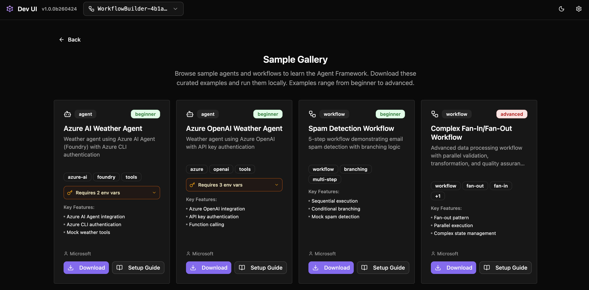
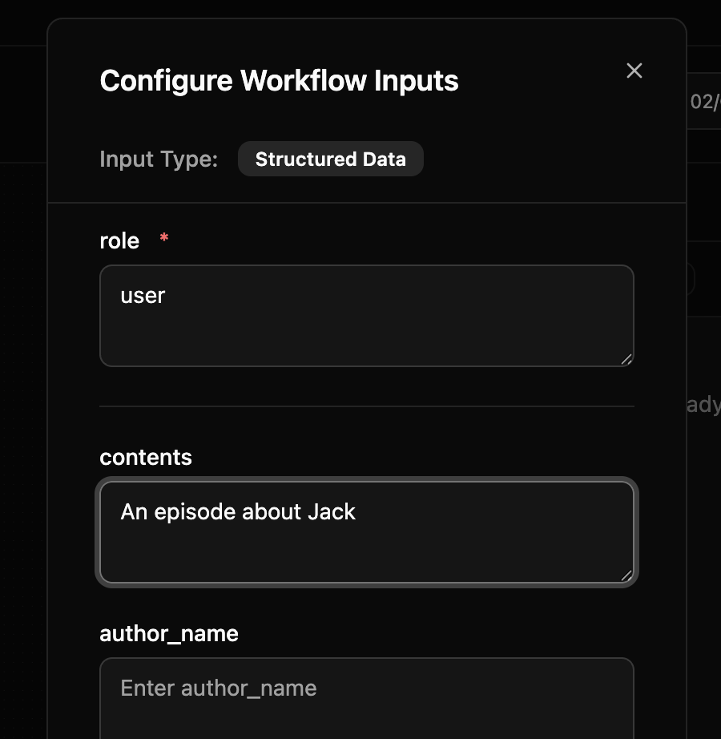
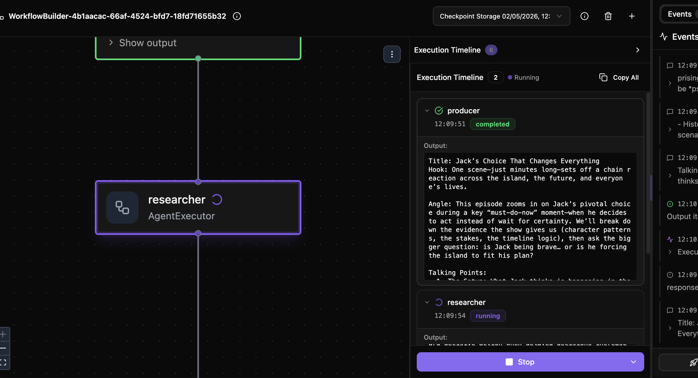

# Building the Workflow (15 minutes)

## Explore Agent Framework Dev UI

The Dev UI lets you test agents interactively in a web interface.


- Chat with your agent in a browser
- See tool calls and reasoning in real time
- Test different prompts and instructions

https://learn.microsoft.com/en-us/agent-framework/devui/?pivots=programming-language-python

## Explore Agent Framework Workflows

Agent Framework workflows allow you to orchestrate complex workflows combining agents and programmatic tools, without getting bogged down in infrastructure complexity.


https://learn.microsoft.com/en-us/agent-framework/workflows/

### Key concepts

- **Agents** — AI-powered executors that use LLMs to process messages.
- **Executors** — Custom logic components (like the review step or saving to file).
- **Edges** — Connections that route messages between executors.
- **Human-in-the-loop** — The ReviewExecutor pauses the workflow for your approval.

## Our AI Podcast Studio Workflow Architecture

```
ProducerAgent -> ResearchAgent -> ScriptWriterAgent -> EditorAgent -> Human Confirmation -> PublisherAgent -> ArtifactWriter
                                                                            ^         |
                                                                            |_________|
                                                                          (rejection loop)
```

### Building the workflow in code

```python
from agent_framework import WorkflowBuilder, AgentExecutor

# Wrap agents as executors
search_executor = AgentExecutor(agent=search_agent, id="search_executor")
script_executor = AgentExecutor(agent=script_agent, id="script_executor")

# Custom executors for review and save
review_executor = ReviewExecutor(id="review_executor")
save_executor = SaveScriptExecutor(id="save_executor")

# Wire them together
workflow = (
    WorkflowBuilder(start_executor=search_executor)
    .add_edge(search_executor, script_executor)
    .add_edge(script_executor, review_executor)
    .add_edge(review_executor, script_executor)   # rejection loop
    .add_edge(review_executor, save_executor)      # approval path
    .build()
)
```

## Exercise: Generate your first podcast script using a Workflow in Dev UI

Run the workflow in the Dev UI using the following command

```bash
python content/3-Building_the_workflow/code/2-podcast-creation-workflow/workflow.py
```

This launches the workflow in a web interface where you can:
- Submit a topic to kick off the pipeline
- Watch each executor process its step
- Approve or reject the generated script
- See the final output saved to a file

1. Expore the workflow on the left side of the screen using drag and drop
2. Click the `Configure and Run` button

3. Configure the workflow with the role as `user` (case sensitive) and the contents as the topic of the podcast episode you want a script for

4. You will then be able to observe the agents working, and respond with confirmation where needed

5. When the editor and publisher ask for feedback and you're happy to proceed, ensure you follow its request and reply `yes` to continue