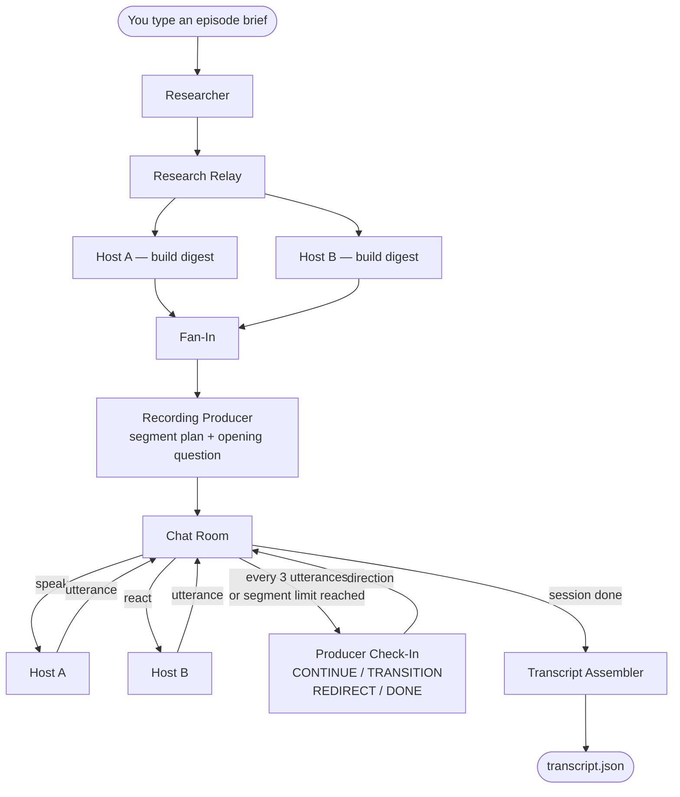

# How it Works

This workflow simulates a live podcast recording session using AI agents. The researcher, recording producer, hosts, and transcript assembler all collaborate through a browser-based Dev UI.

---

## The Cast

| Role | What they do |
|---|---|
| **Researcher** | Writes background notes on the episode topic |
| **Host A & Host B** | Each reads the research and distils a personal digest, then has the on-air conversation utterance-by-utterance |
| **Recording Producer** | Plans segments, opens the session, keeps the conversation on track, and decides when to transition or wrap up |
| **Transcript Assembler** | Converts the raw recording log into a clean structured transcript |

---

## What Happens, Step by Step

### Step 1 — Research
When the workflow starts with an episode topic (for example, *"the impact of AI on creative writing"*), the **Researcher** goes first. It produces notes with facts, angles, and talking points the hosts can use.

### Step 2 — Hosts Do Their Homework (in parallel)
Host A and Host B each read the full research notes and independently produce a compact personal digest — a short bullet-point reference card of the angles, facts, and phrases that feel most natural to their voice. They do this in parallel, so their perspectives stay distinct rather than converging on the same material.

### Step 3 — Producer Opens the Session
The **Recording Producer** reads the research and creates a session plan: a list of segments (like *Cold Open*, *Main Discussion*, *Outro*) each with a soft turn limit, and an opening question to kick things off.

### Step 4 — The Recording Loop
This is the main event. The workflow simulates the conversation as a chat-room exchange:

1. **The producer** gives the first host an opening direction (not logged to the transcript)
2. **Host A speaks** — one utterance at a time
3. **Host B reacts** — responds naturally, or passes with an empty backchannel if nothing needs to be added
4. The workflow decides who earned the floor and repeats

Every **3 utterances**, or when a segment's soft turn limit is reached, the Producer checks in and chooses one of:
- **CONTINUE** — keep going in the current segment
- **TRANSITION** — move to the next segment
- **REDIRECT** — bring the hosts back on track while staying in the segment
- **DONE** — finish the session

The Producer estimates elapsed time using word count at about 130 words per minute, and enforces a hard stop at 110% of the target episode duration.

### Step 5 — Transcript Assembly
When the session ends, the raw conversation log is handed to the **Transcript Assembler**, which converts it into a structured JSON transcript conforming to `utils/podcast-transcript-v1.json`.

---

## How Context Flows to the Hosts

Sending the full researcher output to every host prompt for every utterance would be expensive — the research notes can be thousands of tokens, and the recording loop runs dozens of turns. Instead, each host compresses the research into their personal digest exactly once (Phase 2, in parallel), and that digest is what gets injected on every subsequent call.

During the recording loop, each host prompt is built by `_build_context()`, which assembles four layers:

| Layer | Source | Purpose |
|---|---|---|
| **Your Research Notes** | Host's personal digest (from Phase 2) | The facts and angles that host will actually draw on |
| **Producer Brief** | Producer's segment plan (from Phase 3) | Segment structure and opening question |
| **Session So Far** | Rolling summary written by the producer at each check-in | Covers what's been discussed beyond the recent window |
| **Recent Conversation** | Last 10 utterances from the live log | Immediate conversational context |

The rolling session summary is what makes the sliding window safe: as old utterances fall off the bottom of the 10-utterance window, the producer's summary fills the gap so hosts don't lose track of where the episode has been.

---

## The Outputs

| File | What it is |
|---|---|
| `output/episodes/<date>-<slug>/transcript.json` | Final structured transcript |
| `output/episodes/<date>-<slug>/recording-artifacts/recording/utterances.json` | Every utterance (host and producer) captured during the session |
| `output/episodes/<date>-<slug>/recording-artifacts/recording/producer_brief.md` | The producer's session brief and segment plan |
| `output/episodes/<date>-<slug>/recording-artifacts/recording/research_notes.md` | The Researcher's output |
| `output/episodes/<date>-<slug>/recording-artifacts/traces.jsonl` | Trace file with agent spans and token usage data |

---

## How to Run It

```bash
python content/3-Recording_the_podcast/exercise-4/workflow.py
```

Then open the Dev UI at `http://localhost:8091` and type an episode brief (for example, *"why cats sleep so much"*) to start the recording.

You can also pass the brief directly on the command line:

```bash
python content/3-Recording_the_podcast/exercise-4/workflow.py --brief "why cats sleep so much"
```

---

## Workflow Diagram


