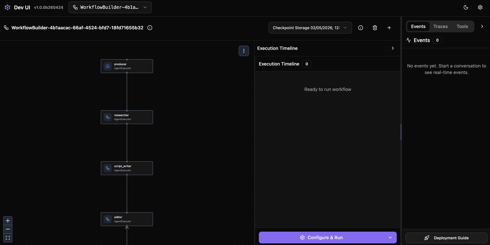
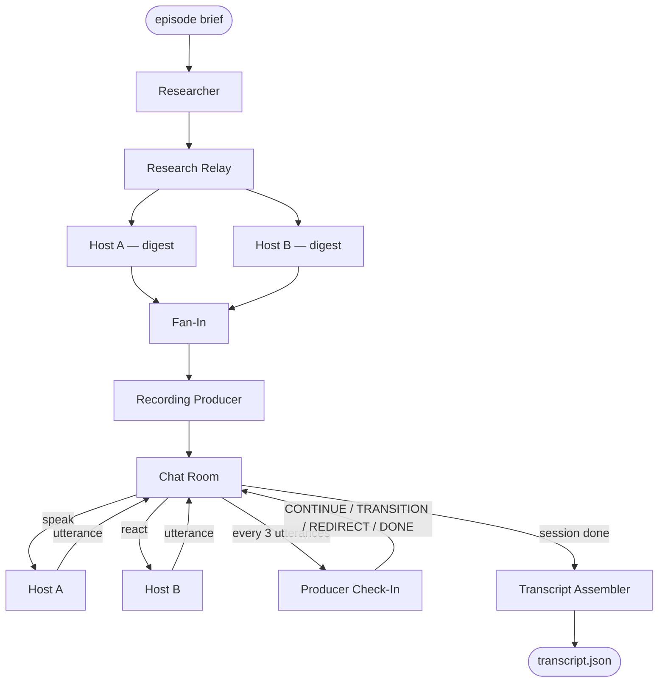

# Recording the Podcast

## Explore Agent Framework Workflows

Agent Framework workflows let you orchestrate complex pipelines by wiring executors (nodes) together with typed edges. The framework handles routing, parallelism, and output collection — you define the graph, it runs it.



https://learn.microsoft.com/en-us/agent-framework/workflows/

### Key concepts

- **Executors** — Processing nodes in the graph. Defined with the `@executor` decorator or by wrapping an agent with `AgentExecutor`.
- **Edges** — Connections that route messages between executors. Added with `builder.add_edge(source, target)`.
- **WorkflowBuilder** — Assembles executors into a runnable graph.
- **Conditional edges** — Route messages down different paths at runtime based on message type.
- **Fan-out** — Multiple edges from one source run all targets in parallel.

## Exercise 3: Build a simple workflow

Learn the workflow building blocks in the [simple-workflow notebook](./exercise-3/simple-workflow.ipynb).

The notebook walks through:

| Section | What you build |
|---|---|
| `@executor` + `WorkflowBuilder` | A 2-node linear workflow |
| Streaming | The same workflow with streaming events |
| `AgentExecutor` | An AI agent as a workflow node |
| Research pipeline | Researcher → bridge executor → host agent |
| Conditional edges | Topic classifier routes to different hosts by type |
| Fan-out | Research output sent to both hosts in parallel |

> **Kernel reminder** — open the kernel picker (top-right in VS Code) and select **Workshop (Python 3.12)** under *Jupyter Kernels*.

## Our AI Podcast Studio Workflow Architecture

Exercise 4 runs a full live-recording pipeline across four phases:

```
Phase 0: Researcher produces notes on the episode topic
Phase 1: Host A and Host B each build a personal research digest (in parallel)
Phase 2: Recording Producer plans segments and writes an opening question
Phase 3: Recording loop — hosts converse utterance-by-utterance while the Producer manages transitions
Phase 4: Transcript Assembler produces a structured transcript JSON
```



## Explore Agent Framework Dev UI

The Dev UI lets you run workflows interactively in a browser.


- Submit input to kick off the workflow
- Watch each executor process its step in real time
- See agent reasoning and tool calls

https://learn.microsoft.com/en-us/agent-framework/devui/?pivots=programming-language-python

## Exercise 4: Record your podcast using a workflow in Dev UI

Run the workflow:

```bash
python content/3-Recording_the_podcast/exercise-4/workflow.py
```

This launches the Dev UI at **http://localhost:8091** (it opens automatically).

Type an episode brief in the chat input to start the recording, for example:

> *why cats sleep so much*

Watch the agents work through the four phases. When the session finishes, outputs are written to:

| File | What it is |
|---|---|
| `output/episodes/<date>-<slug>/transcript.json` | Structured transcript |
| `output/episodes/<date>-<slug>/recording-artifacts/recording/utterances.json` | Every utterance captured |
| `output/episodes/<date>-<slug>/recording-artifacts/recording/producer_brief.md` | Segment plan from the Producer |
| `output/episodes/<date>-<slug>/recording-artifacts/recording/research_notes.md` | Researcher's notes |

> See [how-it-works.md](./exercise-4/how-it-works.md) for a detailed walkthrough of each phase.
