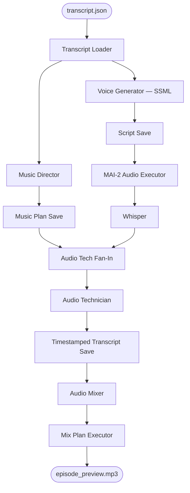

# Engineering the Audio

## From transcript to finished podcast

Exercise 5 takes the `transcript.json` produced in Section 3 and turns it into a mixed audio preview — voices, music, and SFX — using an Agent Framework workflow.

The workflow handles two concerns in parallel: generating speech from the transcript, and designing a music and sound effects plan. Those two tracks converge at the end into a single mixed, normalised audio file.

## Microsoft MAI-2 Voice Text-to-Speech

MAI-2 Voice is Microsoft's neural text-to-speech model. It accepts an SSML document and returns high-quality multi-speaker audio — no GPU required, no model download. You send your script over HTTPS and get an audio file back within seconds.

For a two-host podcast script, MAI-2 is the right choice. It supports per-speaker voice assignment directly in SSML, and the voice quality is well suited to natural-sounding conversation.

## Our Audio Production Workflow Architecture

Exercise 5 runs a full audio production pipeline across five phases:

```
Phase 1:  Transcript Loader reads transcript.json
          └─ Voice Generator converts transcript to SSML script  (parallel)
          └─ Music Director designs the music and SFX plan       (parallel)

Phase 2:  Audio generation
          └─ MAI-2 executor submits SSML to MAI-2 Voice API → speech.mp3
             (or VibeVoice HITL path — see below)

Phase 3:  Whisper transcribes speech.mp3 to get word-level timestamps

Phase 4:  Audio Technician (fan-in: Whisper + music plan)
          → timestamped transcript JSON

Phase 5:  Audio Mixer plans the ffmpeg mix
          └─ Mix Executor runs ffmpeg → episode_preview.mp3
```



### Key concepts

- **Fan-out** — The Transcript Loader sends to the Voice Generator and Music Director simultaneously. Both run while the other is working.
- **Fan-in** — The Audio Technician waits for *both* the Whisper transcription and the music plan before proceeding.
- **HITL** — If you choose the VibeVoice path, the workflow pauses and asks you to place an audio file before continuing.
- **Overlap manifest** — The Voice Generator marks utterances that should play without a silence gap between them. The mix executor uses this when concatenating clips.

## Exercise 5: Generate your podcast audio

Run the workflow:

```bash
python content/4-Engineering_the_audio/exercise-5/workflow.py
```

Pass `--model mai-2` to skip the model selection prompt at startup:

```bash
python content/4-Engineering_the_audio/exercise-5/workflow.py --model mai-2
```

To target a specific episode (partial name match):

```bash
python content/4-Engineering_the_audio/exercise-5/workflow.py --episode cats --model mai-2
```

This launches the Dev UI at **http://localhost:8090** (it opens automatically). If no `--episode` is given, the workflow picks the most recently created episode directory.

> **Prerequisites** — you must have completed Exercise 4 so that a `transcript.json` exists under `output/episodes/`. The `MAI_VOICE_API_KEY` (or equivalent) must be set in your `.env` file to use the MAI-2 path.

### VibeVoice (alternative path)

VibeVoice is an open-source 7B TTS model that runs on a GPU. It produces expressive multi-speaker audio and supports voice cloning from a reference sample. The workflow supports it via a human-in-the-loop step: the workflow generates the VibeVoice script, then pauses and asks you to run the model yourself and place the resulting file in the episode directory before continuing.

To use it, pass `--model vibe-voice`, or select it at the prompt. Instructions for running the model are in [exercise-5/_resources/vibevoice.ipynb](./exercise-5/_resources/vibevoice.ipynb).

## Resuming from a failed step

The Python Dev UI has no way to rerun a single failed step. Instead, restart the workflow with `--resume` and it will detect the most advanced artifact that already exists on disk and pick up from there — skipping everything that already completed successfully.

```bash
python content/4-Engineering_the_audio/exercise-5/workflow.py --resume
python content/4-Engineering_the_audio/exercise-5/workflow.py --episode cats --resume
```

The checkpoint ladder (highest wins):

| Checkpoint | Artifact that must exist | Skips |
|---|---|---|
| 5/5 — ffmpeg only | `mix/mix-plan.json` | All LLM calls and audio generation |
| 4/5 — audio mixer | `mix/timestamped-transcript.json` | Everything up to the Audio Mixer agent |
| 3/5 — whisper | `speech/speech.mp3` | Audio generation; also skips whisper if `whisper/whisper-transcript.txt` exists |
| 2/5 — audio gen | `scripts/mai2/script.xml` or `scripts/vibevoice/script.txt` | Voice Generator and (if `music-plan.json` exists) Music Director |
| 1/5 — full run | *(none)* | Nothing — runs from the beginning using the detected model |

If `music-plan.json` is missing at checkpoints 3 or 2, the workflow re-runs the Music Director in parallel with whatever is being resumed on the audio side.

You can combine `--resume` with `--model` to override the auto-detected model:

```bash
python content/4-Engineering_the_audio/exercise-5/workflow.py --episode cats --model mai-2 --resume
```

## Outputs

All outputs land inside the episode directory under `audio-artifacts/`:

| File | What it is |
|---|---|
| `scripts/mai2/script.xml` | SSML script sent to MAI-2 Voice |
| `scripts/overlap-manifest.json` | Utterance pairs that play without a silence gap |
| `scripts/music-plan.json` | Music and SFX cue plan from the Music Director |
| `speech/speech.mp3` | Raw generated speech (all utterances concatenated) |
| `whisper/whisper-transcript.txt` | Whisper word-level transcription with timestamps |
| `mix/timestamped-transcript.json` | Transcript annotated with per-utterance start/end times |
| `mix/mix-plan.json` | ffmpeg command plan from the Audio Mixer |
| `mix/transcript-with-files.json` | Transcript cross-referenced with music cue files |
| `mix/clips/` | Per-utterance audio clips used during mixing |
| `mix/episode_preview.mp3` | **Final mixed and normalised podcast preview** |
