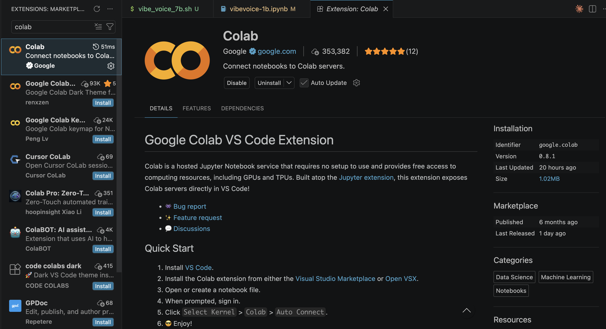
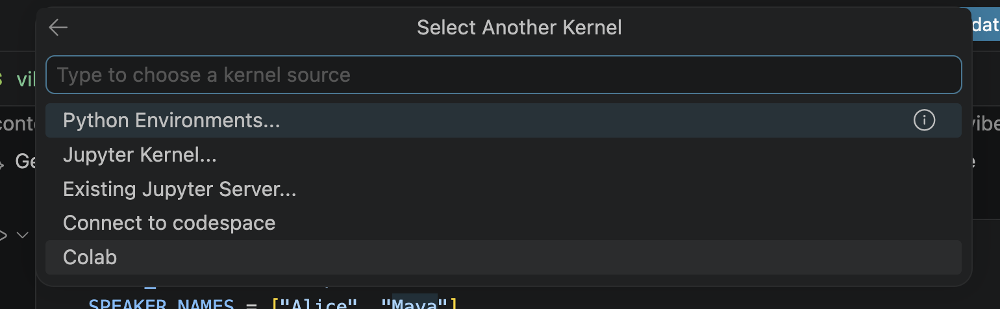
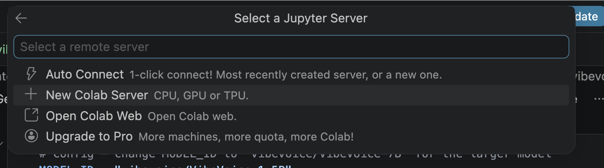
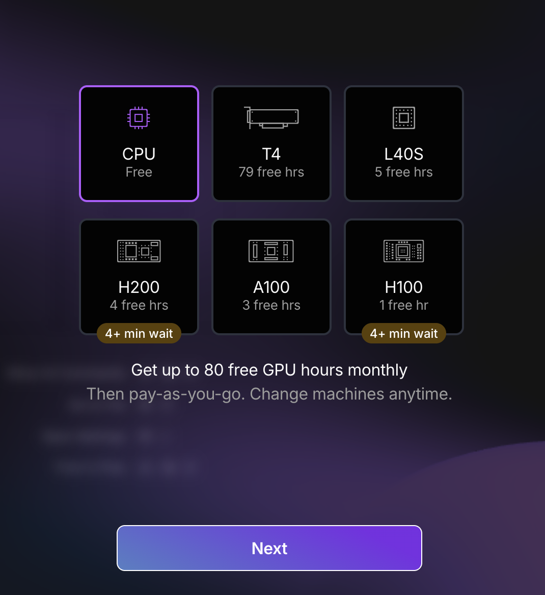
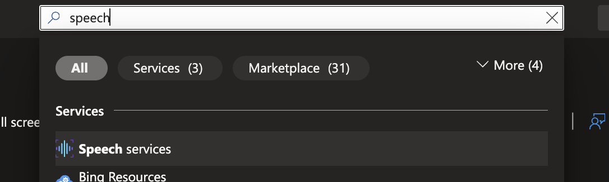
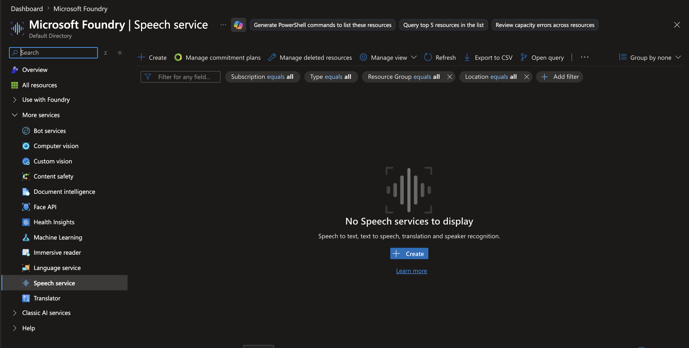
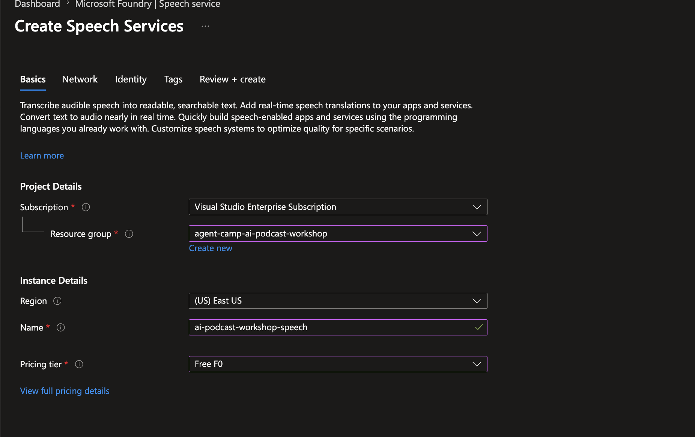

# Generating the audio (20 minutes)

Once approved, the script is saved to a file. Generate audio from it.

To generate the audio we need GPU. That can be limited on most people's machines, so we will look at some ways to do it in the cloud on the cheap.

We are going to go through a few different models to find the right one for our team.

- VibeVoice-1.5B
- VibeVoice-7B
- Azure TTS Dragon HD
- other azure one

## Why VibeVoice?

VibeVoice is an open-source text-to-speech framework designed for expressive, long-form, multi-speaker audio like podcasts. It uses an autoregressive LLM combined with a diffusion head to generate speech from continuous tokens at an ultra-low 7.5 Hz frame rate — keeping output high-fidelity while staying computationally efficient.

Three model sizes are available:

| Model | Params | Max length | Speakers |
|-------|--------|------------|----------|
| VibeVoice-Streaming-0.5B | 0.5B | Real-time | 1 |
| VibeVoice-1.5B | 1.5B | ~90 min | Up to 4 |
| VibeVoice-7B | 7B | ~45 min | Up to 4 |

The source code for VibeVoice itself is under 1 MB — the model weights are downloaded from Hugging Face on first run.

## Why Azure AI Speech

Azure AI Speech is Microsoft's managed cloud TTS service. It requires no GPU and no model download — you send an SSML document over HTTPS and get a WAV back in seconds. That makes it the fastest path from script to audio in a workshop setting, and it's the only option here that works on any machine without any setup beyond a resource key.

The Dragon HD voices are also simply some of the highest quality neural TTS voices available today. They support a broad expressive style system — over 60 named styles like `cheerful`, `whispering`, `sarcastic`, `documentary-narration` — plus paralinguistics like `[laughter]` and `[sighing]` that you can drop inline into the SSML. For a two-host podcast conversation that needs to sound natural, this matters.

### VibeVoice vs Azure Dragon HD: when to use which

| | VibeVoice 1.5B / 7B | Azure Dragon HD |
|---|---|---|
| **Where it runs** | Your GPU (Colab T4 / Lightning A100) | Azure cloud — no GPU needed |
| **Cost** | Free (Colab / Lightning free tier) | Pay-per-character (small, but not free) |
| **Voice style control** | Implicit — driven by punctuation and word choice in the script | Explicit — `<mstts:express-as style="...">` tags in SSML |
| **Speaker count** | Up to 4 distinct voices | Unlimited — one `<voice>` block per turn |
| **Max audio length** | ~90 min (1.5B), ~45 min (7B) | 600 seconds per request (use Batch API for longer) |
| **Voice cloning** | Yes — supply a reference audio sample | No (Personal Voice is a separate, paid feature) |
| **Output quality** | Very expressive, slightly variable — the model makes judgment calls | Highly consistent and controlled |
| **Latency** | Minutes (model load + inference) | Seconds |
| **Best for** | Experimenting with open-source TTS, voice cloning, offline use | Quick iteration, production quality, no GPU access |

For this workshop, Azure Speech is the most reliable way to hear your script as audio within the session. VibeVoice gives you more creative control and is worth running at home.

[Azure AI Voice Gallery](https://ai.azure.com/explore/models/aiservices/Azure-AI-Speech/version/1/registry/azureml-cogsvc/tryout?tid=54ba0fd2-46b7-46d8-9f55-c1500e37a2c2#voicegallery)


## Exercise: Generate your podcast audio

Choose the model of your choice and start generating

### VibeVoice-1.5B

**Requirements:** A Google account. No local GPU needed — Colab provides one for free.

**One-time setup — install the VS Code Colab extension**

1. Open the Extensions panel (`Ctrl+Shift+X` / `Cmd+Shift+X`), search **Colab**, and install the extension published by Google.


**Running the notebook**

2. Open [vibevoice-1b.ipynb](./vibevoice-1b.ipynb).
3. Click **Select Kernel** (top-right of the notebook) → **Select Another Kernel** → **Colab**.

   VS Code will open a browser tab — sign in with your Google account.
4. Back in VS Code, click **Select Kernel** again and choose the Colab option again, then `New Colab Server`. Create one and ensure it is `GPU`, `T4`, `Latest`, and name it something appropriate.

5. After it has loaded you will be finally prompted to select the kernal. Select `Python 3 (ipykernal)`.
6. Update your config at the top, and then run all the cells in the notebook to generate your audio.

### VibeVoice-7B
1. Go to [lightning.ai](https://lightning.ai/) and sign up

2. Click next through the onboarding survey until you see this, and select A100, then click next
. You will be asked to verify your phone number
3. Once your workspace loads, create a file `vibevoice-7b.sh` in the root
4. Paste the contents of [vibevoice-7b.sh](./vibevoice-7b.sh) in
5. Run `chmod +x ./vibe_voice_7b.sh` in the terminal
6. Copy your clipped vibe voice script file into the workspace
7. Run `./vibevoice-7b.sh` and pass in the name of your speakers and the file name

```bash
./vibe_voice_7b.sh ./my-script.txt Lucy Maya
```
7. Wait for your audio to be generated then download

### Azure Text-To-Speech
The easiest way to test your script with Azure Text-To-Speech will be to use the Playground available in Azure AI Foundry.

1. Go to your Foundry resource and select `Models`. Select the `AI Services` tab, and then select `Azure Speech - Text to Speech` and open in playground.
2. Select the `Code` tab, and paste the contents of your Azure Speech SSML Clipped Script file into the 

#### Programmatic script
Alternernatively, you can use the script in this repo to access Azure Text-To-Speech via the Speech api.

1. Go to the azure portal and search for speech services

2. Select create a new Speech resource

3. Select the same resource group you made earlier for this workshop or select a new one, come up with an appropriate name, and then select the `Free F0` tier.

4. Select `Review + Create` and then `Create`. When your resource is deployed, go to it.
5. In your speech service you will see an Endpoint. The first part of the endpoint is the region of your resource. e.g. `https://eastus.api.cognitive.microsoft.com/` is `eastus`. Set this value as `AZURE_SPEECH_REGION` in your .env file
6. You will see a link to manage keys on the home page of your speech resource, click that, and set one of those keys as the value of the `AZURE_SPEECH_KEY` in your .env file.
7. 
Run the following command from root to generate the audio from an SSML file.
```bash

python generate_azure_speech.py <path to ssml script> <path to output folder>

# from root
python content/4-Executing-the-workflow/generate_azure_speech.py content/3-Building_the_workflow/code/2-podcast-creation-workflow/output/<your-azure-speech-ssml-clipped-script-file> content/4-Executing-the-workflow/azure-speech-output
```

### Full length audio
When you have more time, run the generation on the full length scripts of your podcasts, and then listen and enjoy!