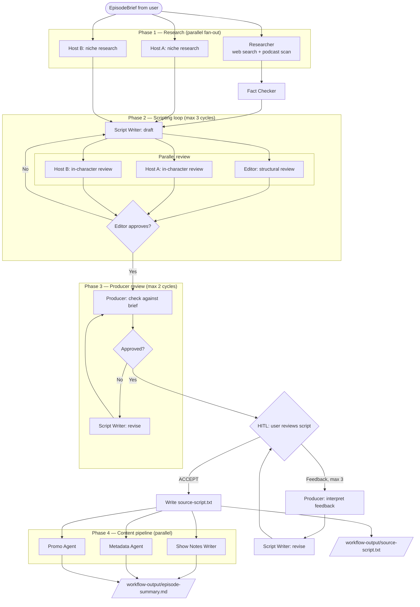
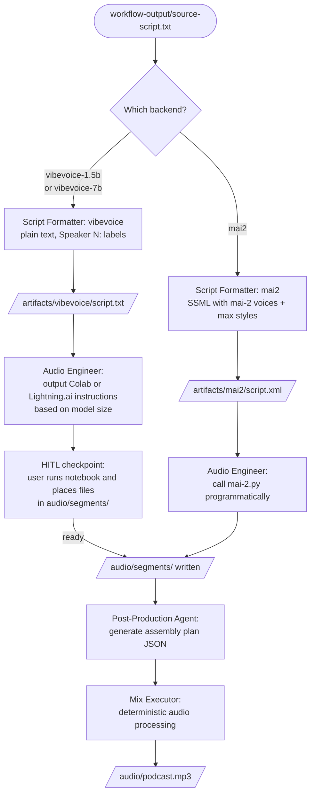

# Workshop Rework — Revised Plan

## Summary

| Section | Was | Becomes |
|---|---|---|
| 2 | Agent artifact builder (manual / LLM / script) | **Grounding & Context** — Show Setup Workflow + agent definition files |
| 3 | Simple 5-agent linear workflow | **Episode Production Workflow** — multi-phase pipeline → source script + episode summary |
| 4 | Manual TTS per notebook/script | **Audio Engineer & Mix Executor** — choose backend, format for it, generate audio |

---

## Output Folder

New `output/` directory at repo root (alongside `content/`). All generated content lives here — nothing written into `content/`.

| Path | Description |
|---|---|
| `output/show_context.md` | Shared show memory — loaded by every agent |
| `output/agents/<name>.md` | Agent definition files — system prompt + persona for each agent |
| `output/episodes/<date>-<slug>/` | One directory per episode, e.g. `2026-06-20-ai-agents-in-production` |
| `.../workflow-output/source-script.txt` | Canonical script from agents |
| `.../workflow-output/episode-summary.md` | Brief, editorial notes, show notes, metadata, promo assets |
| `.../artifacts/vibevoice/script.txt` | VibeVoice plain-text format |
| `.../artifacts/azure-ssml/script.xml` | Azure SSML with Azure voice IDs |
| `.../artifacts/mai2/script.xml` | Azure SSML with mai-2 voice IDs, max style usage |
| `.../audio/segments/` | Per-segment audio files (placed by user or generated) |
| `.../audio/podcast.mp3` | Final mix |

### `show_context.md` structure

Human-readable markdown injected verbatim into every agent's system prompt. No agent hard-codes show names, hosts, or tone — it all comes from here.

```markdown
# Show Context: [Show Name]

## Identity
- **Name / Tagline:** ...
- **Format:** ...       # e.g. "Two hosts, deep-dive, 30-45 min, weekly"
- **Target audience:** ...
- **Tone:** ...
- **Brand voice notes:** ...

## Recurring Segments
- Cold Open
- Main Topic
- Hot Take
- Picks

## Hosts

### [Host Name]
- **Persona:** ...
- **Niche:** ...
- **Voice IDs:**
  - vibevoice: Alice
  - azure-ssml: en-US-AndrewMultilingualNeural
  - mai2: en-US-Ethan:MAI-Voice-2

## Episode History

(Appended after each episode — lets agents avoid topic repetition and build callbacks)

### 2026-06-20 — [Episode Title]
- **Topic / Angle:** ...
- **Key moments:** ...
```

Episode history grows over time, making the show self-referential.

### Agent definition files (`output/agents/`)

One markdown file per agent. Each `.py` agent file loads its system prompt from the corresponding `.md` — no personas hardcoded in Python.

| File | Agent | Source persona |
|---|---|---|
| `show-concept.md` | Show Concept Agent | `plan.md §3.1` |
| `researcher.md` | Researcher | `plan.md §3.3` |
| `fact-checker.md` | Fact Checker | `plan.md §3.4` |
| `host.md` | Host Agent (template, one instance per host) | `plan.md §3.5` |
| `script-writer.md` | Script Writer | `plan.md §3.6` |
| `editor.md` | Editor | `plan.md §3.7` |
| `producer.md` | Producer | `plan.md §3.2` |
| `script-formatter.md` | Script Formatter (covers all three backend modes) | `plan.md §3.8` |
| `show-notes-writer.md` | Show Notes Writer | `plan.md §3.12` |
| `metadata.md` | Metadata / SEO Agent | `plan.md §3.13` |
| `promo.md` | Promotional Content Agent | `plan.md §3.14` |
| `audio-engineer.md` | Audio Engineer | `plan.md §3.9` |
| `post-production.md` | Post-Production / Mixer | `plan.md §3.11` |
| `music-director.md` | Music Director | `plan.md §3.10` |

The `.md` files are the source of truth for what each agent does. Participants read and can edit these in Section 2 — Section 3 then shows how those definitions become real agents in code.

---

## Section 2 — Grounding & Context

Section 2's goal: before writing any workflow code, participants understand *who* the agents are, *what context* they operate with, and *why* that context matters for LLM behaviour.

### What changes

- **Remove:**
  - `content/2-Understanding_the_workflow/podcast-agent-builder-agent/`
  - `content/2-Understanding_the_workflow/podcast-agent-artifacts/`
- **Keep:** `templates/host-definition-templates/` — still useful reference for picking host archetypes
- **Add:** `content/2-Understanding_the_workflow/show-setup-workflow/workflow.py`

### Exercise 1 — Show Setup Workflow

Implements `plan.md §5.1`. A conversational loop:

1. Show Concept Agent asks one topic at a time (name, format, audience, tone, hosts, segments, brand voice)
2. User responds freely — agent pushes back on vague answers
3. Loop continues until user types `CONFIRM` (case-insensitive)
4. Workflow writes `output/show_context.md` and seeds all `output/agents/*.md` files with the show name and host details interpolated into each persona template
5. Cycle guard: max 20 turns

```bash
python content/2-Understanding_the_workflow/show-setup-workflow/workflow.py
```

### Exercise 2 — Explore the agent definitions

After the workflow runs, participants open `output/agents/` and read through the definition files. The README walks through a few key ones — Producer, Researcher, Host — to illustrate how the same `show_context.md` is injected into different roles with different goals.

Participants can edit any `.md` file before moving to Section 3. Changes they make here flow directly into the agents in the workflow — no Python to touch.

### README structure

1. What makes a good podcast (keep — sets the mental model)
2. The host-dimensions table (keep)
3. How we ground LLMs — explain `show_context.md` as shared memory, agent definitions as role instructions
4. Exercise 1: Run the Show Setup Workflow
5. Exercise 2: Read through the agent definitions, customise if desired
6. What's next: Section 3 wires these definitions into a workflow

---

## Section 3 — Episode Production Workflow

### What changes

- **Remove:**
  - `content/3-Building_the_workflow/code/1-meet-your-agents/`
  - `content/3-Building_the_workflow/code/2-podcast-creation-workflow/`
- **Add:** `content/3-Building_the_workflow/code/episode-production-workflow/`

### Code structure

`content/3-Building_the_workflow/code/episode-production-workflow/`

| File | Role | Model |
|---|---|---|
| `workflow.py` | Orchestrates all phases | — |
| `agents/researcher.py` | Loads `output/agents/researcher.md` | Full |
| `agents/fact_checker.py` | Loads `output/agents/fact-checker.md` | Fast |
| `agents/host_agent.py` | Factory — loads `output/agents/host.md`, one instance per host | Fast |
| `agents/script_writer.py` | Loads `output/agents/script-writer.md` | Full |
| `agents/editor.py` | Loads `output/agents/editor.md` | Fast |
| `agents/producer.py` | Loads `output/agents/producer.md` | Full |
| `agents/show_notes_writer.py` | Loads `output/agents/show-notes-writer.md` | Fast |
| `agents/metadata_agent.py` | Loads `output/agents/metadata.md` | Fast |
| `agents/promo_agent.py` | Loads `output/agents/promo.md` | Fast |
| `agents/music_director.py` | Loads `output/agents/music-director.md` — **defined, not wired into workflow yet** | Fast |

Every agent also loads `output/show_context.md` and prepends it to its system prompt.

### Workflow phases

Implements `plan.md §5.2`, stopping before audio generation.

| Phase | Agents | Mode | Cycle guard |
|---|---|---|---|
| 1. Research | Researcher + all Host agents | Parallel (`asyncio.gather`) | — |
| 1b. Fact-check | Fact Checker | Sequential (depends on Researcher) | — |
| 2. Scripting | Script Writer → Editor + Hosts | Write → parallel review → loop | Max 3 cycles |
| 3. Producer review | Producer → Script Writer | Sequential loop | Max 2 cycles |
| HITL 1 | — | User reviews script | Max 3 feedback rounds |
| 4. Content pipeline | Show Notes, Metadata, Promo | Fully parallel | — |

Phase 4 runs on the approved script. Source script is written to disk at the same time.



### Output written

- `output/episodes/<date>-<slug>/workflow-output/source-script.txt` — host-by-host dialogue with expression cues, in the shared source format defined in `utils/script_format_vibevoice.md`
- `output/episodes/<date>-<slug>/workflow-output/episode-summary.md` — brief, editorial notes, show notes, metadata, promo assets

Episode history entry appended to `output/show_context.md`.

### README changes

- Explain how agent `.py` files load from `output/agents/*.md` — the definitions participants wrote in Section 2 are now running
- Update workflow architecture diagram to show multi-phase pipeline
- Explain that `source-script.txt` is the handoff to Section 4 — formatted per-backend there
- Exercise: enter an `EpisodeBrief`, step through the pipeline in Dev UI, approve the script, observe outputs

---

## Section 4 — Audio Engineer & Mix Executor

Section 4 focuses on the technical workflow construction: how to build a workflow that branches on user input, how to handle steps that can't run locally, and how to hand off between an AI agent and deterministic code.

### What changes

- **Remove:** old notebook-first / manual exercise instructions from readme
- **Keep:** `vibe-voice-voices/`, `vibevoice.ipynb`, `generate_azure_speech.py`, `mai-2.py`
- **Add:** `content/4-Executing-the-workflow/audio-workflow/`

### Code structure

`content/4-Executing-the-workflow/audio-workflow/`

| File | Role |
|---|---|
| `workflow.py` | Orchestrates the audio pipeline; prompts for backend choice |
| `agents/script_formatter.py` | Loads `output/agents/script-formatter.md`; formats source script for the chosen backend only |
| `agents/audio_engineer.py` | Loads `output/agents/audio-engineer.md`; backend-aware |
| `agents/post_production.py` | Loads `output/agents/post-production.md`; produces assembly plan |

### Workflow behaviour

1. **Backend prompt** — user selects: `vibevoice-1.5b` / `vibevoice-7b` / `mai2`
2. **Script Formatter** — loads `workflow-output/source-script.txt` and formats it for the chosen backend only, writing the artifact into `artifacts/<backend>/`
3. **Audio Engineer agent:**
   - **mai2** — calls `mai-2.py` programmatically, writes segments to `output/episodes/<slug>/audio/segments/`
   - **vibevoice-1.5b / 7b** — cannot run locally; agent outputs explicit step-by-step instructions (which notebook, which file to upload, where to place the output), then workflow suspends at a HITL checkpoint until user types `ready`
4. **Post-Production agent** — generates assembly plan JSON from the segment files
5. **Mix executor** (deterministic code, not an agent) — executes assembly plan → `output/episodes/<slug>/audio/podcast.mp3`



> **Dependency note:** No audio mixing library is in `requirements.txt` and `ffmpeg` is not installed. Needs resolving: options are `pydub` + ffmpeg, `soundfile` + `numpy`, or skip automated mixing and leave the assembly plan as the deliverable for this section.

### Script Formatter — per-backend behaviour

**vibevoice mode** — follows `utils/script_format_vibevoice.md`:
- Strip all cues, map host names → `Speaker 1:` / `Speaker 2:`
- One turn per line, no blank lines between turns
- Chunk long monologues at sentence boundaries (~50 words max per line)

**mai2 mode** — follows `utils/script_format_azure_ssml.md` structure, with:
- mai-2 voice IDs from `show_context.md` (format: `en-US-Ethan:MAI-Voice-2`)
- Agent instructed to maximise style usage: every turn gets an explicit `express-as` style, pauses at natural beat points, paralinguistics (`[laughter]`, `[sighing]`) where appropriate
- Configured via `MAI_VOICE_2_ENDPOINT` + `MAI_VOICE_2_KEY` env vars

### README structure

1. VibeVoice vs mai-2 comparison table (keep — relevant for the choice prompt)
2. Explain the workflow design challenge: branching on backend choice, formatting only what you need, HITL for GPU steps
3. Walk through the workflow code structure (how the branch works, how the HITL checkpoint is set up)
4. Exercise: run the workflow, choose a backend, observe the formatter and audio engineer's behaviour for that path

---

## Music Director

Agent definition at `output/agents/music-director.md` (written by Show Setup Workflow in Section 2).
Python file at `content/3-Building_the_workflow/code/episode-production-workflow/agents/music_director.py` — defined, not wired into either workflow yet.

Placeholder comment in `audio-workflow/workflow.py`:

```python
# TODO: wire in Music Director after tools are implemented
# Runs in parallel with Audio Engineer; both feed into Post-Production
```

---

## Files to Delete

| Path | Reason |
|---|---|
| `content/2-Understanding_the_workflow/podcast-agent-builder-agent/` | Replaced by Show Setup Workflow |
| `content/2-Understanding_the_workflow/podcast-agent-artifacts/` | Generated by old builder |
| `content/3-Building_the_workflow/code/1-meet-your-agents/` | Replaced by new agent module |
| `content/3-Building_the_workflow/code/2-podcast-creation-workflow/` | Replaced by Episode Production Workflow |

---

## Decisions

1. **Episode slug format** — auto-derived from the episode brief topic (e.g. `2026-06-20-ai-agents-in-production`). No user input needed.

2. **mai-2 voice IDs** — full list at https://learn.microsoft.com/en-us/azure/ai-services/speech-service/mai-voices. The Show Setup Workflow should fetch or reference this list when prompting the user to assign voices to hosts.

3. **Mix executor** — skipped for now. The Post-Production agent's assembly plan JSON is the Section 4 deliverable. Automated mixing is a stretch goal to be added later.
