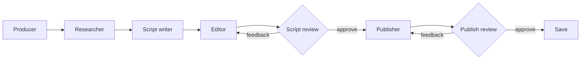

# The AI Podcast Studio

Build an AI-powered podcast pipeline with Microsoft Agent Framework

<div class="pt-12">
  <span class="px-2 py-1 rounded bg-white bg-opacity-10">
    Agent Camp · Microsoft HQ · 2 May 2026
  </span>
</div>

<div class="abs-br m-6 flex gap-2">
  <a href="https://github.com/microsoft/edgeai-for-beginners" target="_blank" class="text-xl slidev-icon-btn opacity-50 !border-none !hover:text-white">
    <carbon-logo-github />
  </a>
</div>

<!--
Welcome everyone — this is a hands-on workshop. By the end of the next hour
you'll have your own AI-generated podcast episode.
-->

---
layout: center
---

# Agenda

| | Section | Time |
|---|---------|------|
| 1 | Welcome & intro | 5 min |
| 2 | What we're building | 5 min |
| 3 | Environment setup | 10 min |
| 4 | Understanding the workflow | 10 min |
| 5 | Building the workflow | 20 min |
| 6 | Generating the audio | 20 min |
| 7 | Wrap-up & cleanup | 5 min |

<!--
We're going to alternate: short theory talk, then you do the exercise while
I demo. Stop me at any point — questions are good.
-->

---
layout: intro
---

# Hi, I'm Sarah

<div class="grid grid-cols-2 gap-8 pt-6">

<div>

- Software engineer @ Microsoft
- I like building with AI agents and breaking them in interesting ways
- Podcast nerd — I run a lot to celebrity interview podcasts

</div>

<div>

**Find me after**

<carbon-logo-github class="inline" /> github.com/sarahlevins<br>
<carbon-logo-linkedin class="inline" /> linkedin.com/in/sarahlevins

</div>

</div>

<!--
Quick intro. The reason I built this workshop: I wanted a podcast on a niche
topic, none existed, and turns out agents are pretty good at making one.
-->

---
layout: section
---

# 1. What we're building

Your podcast idea → a real audio episode

---

# The output

By the end of the hour, you will have:

<v-clicks>

- A **podcast concept** of your own
- A team of **AI agents** (producer, researcher, script writer, editor, publisher)
- A **multi-agent workflow** that turns your idea into a full script
- An actual **audio file** — two AI hosts having a conversation about your topic

</v-clicks>

<div v-click class="pt-8 text-center text-xl opacity-80">
You'll leave with the artifacts. Take them home, tweak them, make weird podcasts.
</div>

---

# Built on Edge AI for Beginners

<div class="grid grid-cols-2 gap-8 pt-4">

<div>

This workshop is **based on** Microsoft's
[`edgeai-for-beginners`](https://github.com/microsoft/edgeai-for-beginners/tree/main/WorkshopForAgentic)
agentic module.

The original runs the agents on **models on your own device** — which is
brilliant for learning Edge AI, but the inference is **far too slow** to
finish inside a one-hour session.

</div>

<div>

So today we're swapping the local edge models for **Azure AI Foundry** (or
Ollama running in the Codespace if you prefer), keeping the same agentic concepts.

<div class="pt-4 p-4 rounded bg-blue-500 bg-opacity-10 border border-blue-500">

**Take it home** — the original module is excellent. Run it at your own pace
to see how the same workflow behaves on truly on-device models.

<div class="pt-2 text-sm opacity-70">
<carbon-logo-github class="inline" /> microsoft/edgeai-for-beginners
</div>

</div>

</div>

</div>

---

# The tech stack

<div class="grid grid-cols-2 gap-12 pt-8">

<div>

### <carbon-flow class="inline" /> Orchestration

- **Microsoft Agent Framework** (Python)
- `WorkflowBuilder`, `AgentExecutor`
- Human-in-the-loop review step

<div class="pt-6"></div>

### <carbon-machine-learning-model class="inline" /> Models · *your choice*

- **Azure AI Foundry** — fastest
- **Ollama** — local, offline, slower

</div>

<div>

### <carbon-microphone class="inline" /> Audio generation

- **VibeVoice 1.5B / 7B** — open-source, expressive multi-speaker TTS
- **Azure AI Speech** — Dragon HD voices via SSML

<div class="pt-6"></div>

### <carbon-development class="inline" /> Dev environment

- **GitHub Codespaces** (recommended)
- or local Python 3.10+

</div>

</div>

---
layout: center
class: text-center
---

# Grab the workshop repo

Everything you need lives here — clone, fork, or just follow along.

<div class="pt-8">

<a href="https://github.com/sarahlevins/ai-podcast-workshop#the-ai-podcast-studio-workshop" target="_blank" class="text-2xl font-mono px-4 py-2 rounded bg-blue-500 bg-opacity-20 border border-blue-400">
<carbon-logo-github class="inline" /> github.com/sarahlevins/ai-podcast-workshop
</a>

</div>

<div class="pt-10 opacity-70">
Open the README and follow along — every section links to its content folder.
</div>

---
layout: section
---

# 1. Environment setup

10 minutes — pick your path

---

# Choose your setup

<div class="grid grid-cols-2 gap-6 pt-4">

<div class="p-4 rounded border border-green-500">

### <carbon-cloud /> Codespace · *recommended*

- Pre-built, models baked in
- Just click and go
- Needs a GitHub account
- GitHub spend may apply

</div>

<div class="p-4 rounded border border-blue-500">

### <carbon-laptop /> Local

- Fork & clone the repo
- Python 3.10+
- Use Azure AI Foundry **or** Ollama

</div>

</div>

<div v-click class="pt-8">

Then pick your **model provider** in `code/.env`:

| Provider | `MODEL_PROVIDER` | When |
|---|---|---|
| Azure AI Foundry | `foundry` | You have a subscription. Fastest. |
| Ollama | `ollama` | Offline / using the Codespace defaults |

</div>

<!--
I'll demo launching the codespace now, then walk around to help anyone stuck.
Setup test notebook validates everything works before we move on.
-->

---
layout: center
class: text-center
---

# Demo: Setting up the Codespace & Foundry

Then I'll come around the room — wave me over if you're stuck.

<div class="pt-8 text-sm opacity-70">
Run the <code>setup-test.ipynb</code> notebook to confirm your model is reachable.
</div>

---
layout: section
---

# 2. Understanding the workflow

Translating a real-world process into agents

---

# What makes a good podcast?

<v-clicks>

- **Host chemistry** — distinct roles, not two people saying the same thing
- **Structure** — strong hook, clear segments, satisfying wrap-up
- **Conversational tone** — eavesdropping, not lecturing
- **Pacing** — mix light moments with deep dives
- **Complementary hosts** — one asks, the other answers

</v-clicks>

<div v-click class="pt-6 italic opacity-80">
The tension between hosts is what makes podcasts engaging — and it's exactly
what we encode into our agent instructions.
</div>

---

# How podcasts get made

<div class="grid grid-cols-5 gap-3 pt-6">

<div class="p-3 rounded bg-blue-500 bg-opacity-20 text-center">
  <div class="text-2xl"><carbon-idea /></div>
  <div class="font-bold pt-2">Producer</div>
  <div class="text-xs opacity-70">Angle, title, talking points</div>
</div>

<div class="p-3 rounded bg-blue-500 bg-opacity-20 text-center">
  <div class="text-2xl"><carbon-search /></div>
  <div class="font-bold pt-2">Research</div>
  <div class="text-xs opacity-70">Facts, stats, examples</div>
</div>

<div class="p-3 rounded bg-blue-500 bg-opacity-20 text-center">
  <div class="text-2xl"><carbon-pen /></div>
  <div class="font-bold pt-2">Script writer</div>
  <div class="text-xs opacity-70">Multi-speaker dialog</div>
</div>

<div class="p-3 rounded bg-blue-500 bg-opacity-20 text-center">
  <div class="text-2xl"><carbon-edit /></div>
  <div class="font-bold pt-2">Editor</div>
  <div class="text-xs opacity-70">Tighten, check pacing</div>
</div>

<div class="p-3 rounded bg-blue-500 bg-opacity-20 text-center">
  <div class="text-2xl"><carbon-save /></div>
  <div class="font-bold pt-2">Publisher</div>
  <div class="text-xs opacity-70">Save the artifact</div>
</div>

</div>

<div v-click class="pt-10 text-center text-xl">
Each one becomes <span class="text-orange-400 font-bold">one agent</span> in our workflow.
</div>

---

# Designing host personalities

| Dimension | Curious host | Expert |
|---|---|---|
| Role | Asks questions | Provides answers |
| Knowledge | Beginner | Deep expertise |
| Style | Short, analogies | Structured, examples |
| Humor | Playful | Dry, deadpan |
| Catchphrases | "Wait, what?" | "Well actually..." |
| Conflict style | Pushes for simpler | Pushes back on oversimple |

<div v-click class="pt-4 opacity-80">
Templates live in <code>templates/host-definition-templates/</code> — pick two complementary archetypes.
</div>

---
layout: center
class: text-center
---

# Exercise: build your agent artifacts

Pick **one** of three paths

<div class="grid grid-cols-3 gap-4 pt-8">

<div class="p-4 rounded border">
  <div class="font-bold">A · Agent builder</div>
  <div class="text-sm opacity-70 pt-2">Run the Python builder, chat your concept in</div>
</div>

<div class="p-4 rounded border">
  <div class="font-bold">B · External LLM</div>
  <div class="text-sm opacity-70 pt-2">Paste the prompt into your favourite chatbot</div>
</div>

<div class="p-4 rounded border">
  <div class="font-bold">C · By hand</div>
  <div class="text-sm opacity-70 pt-2">Fill the templates yourself — see the seams</div>
</div>

</div>

<div class="pt-8 text-sm opacity-70">
Output: 5 files in <code>content/2-Understanding_the_workflow/podcast-agent-artifacts/</code>
</div>

---
layout: section
---

# 3. Building the workflow

Wiring agents together with Agent Framework

---

# What is Microsoft Agent Framework?

<div class="grid grid-cols-2 gap-8 pt-4">

<div>

An **open-source engine** for building and orchestrating intelligent AI agents.

- Multi-language: **.NET** and **Python**
- From simple chat agents → complex **multi-agent workflows** with graph-based orchestration
- Built-in support for **Azure AI Foundry**, OpenAI, MCP, memory, and more
- The framework we're using to wire our podcast pipeline together today

<div class="pt-6">

<a href="https://aka.ms/agent-framework" target="_blank" class="text-lg font-mono px-3 py-1 rounded bg-blue-500 bg-opacity-20 border border-blue-400">
<carbon-launch class="inline" /> aka.ms/agent-framework
</a>

</div>

</div>

<div>


</div>

</div>

---

# Agent Framework — key concepts

<v-clicks>

- **Agents** — AI executors that use LLMs to process messages
- **Executors** — custom logic (review step, save-to-file)
- **Edges** — connections that route messages between executors
- **Human-in-the-loop** — pause the workflow for your approval
- **Dev UI** — chat with agents in a browser, see tool calls live

</v-clicks>

<div v-click class="pt-6 text-sm opacity-70">
Docs: <code>learn.microsoft.com/agent-framework/workflows</code>
</div>

---

# Agent Framework — Agents

An agent = **a chat client + instructions + (optional) tools**.

```python {1-5|7-12}{at:1}
client = FoundryChatClient(
    project_endpoint=os.getenv("FOUNDRY_PROJECT_ENDPOINT"),
    model=os.getenv("FOUNDRY_MODEL"),
    credential=credential,
)

agent = Agent(
    client=client,
    name="Simple Southern Agent",
    instructions="You are my assistant. Answer in a southern accent with southern charm.",
)

response = await agent.run("how's the weather in Perth this weekend?")
```

<div v-click class="pt-4 opacity-80">
But hard-coding <code>FoundryChatClient</code> means we're locked to one provider.
For the workshop we want to swap between Foundry, Ollama, and GitHub Copilot
without touching agent code…
</div>

---

# `create_agent` — one helper, three providers

<div class="grid grid-cols-2 gap-6 pt-2">

<div>

```python {all|11-14|16-17|18-19|20-21}{at:1}
@dataclass
class AgentOptions:
    name: str = "Agent"
    instructions: str = "You are a helpful assistant."
    tools: list[Any] = field(default_factory=list)
    extra: dict[str, Any] = field(default_factory=dict)


def create_agent(options: AgentOptions | None = None):
    provider = os.getenv("MODEL_PROVIDER", "").lower()

    if provider == "ollama":
        return _create_ollama_agent(options)
    elif provider == "github-copilot":
        return _create_github_copilot_agent(options)
    elif provider == "foundry":
        return _create_foundry_agent(options)
    else:
        raise ValueError(f"MODEL_PROVIDER={provider!r} not supported")
```

</div>

<div class="text-sm">

The `MODEL_PROVIDER` env var picks the backend, the rest comes from
provider-specific env vars:

| Provider | Env vars |
|---|---|
| `ollama` | `OLLAMA_HOST`, `OLLAMA_CHAT_MODEL_ID` |
| `github-copilot` | `GITHUB_COPILOT_MODEL` |
| `foundry` | `FOUNDRY_PROJECT_ENDPOINT`, `FOUNDRY_MODEL`, `FOUNDRY_API_KEY` |

<div class="pt-4 opacity-80">
This means every agent in our pipeline is provider-agnostic — swap one env var
and the whole workflow runs against a different model.
</div>

</div>

</div>

---
layout: center
class: text-center
---

# Exercise: meet your agents

Open the notebook and chat to each of your podcast agents one-by-one.

<div class="pt-6">

```bash
content/2-Building_the_workflow/code/1-meet-your-agents/your-podcast-studio-agents.ipynb
```

</div>

<div class="pt-8 text-left max-w-xl mx-auto opacity-80">

- See how the **producer** spins up an angle from your concept
- Watch the **researcher** dig up facts
- Get a feel for each agent's **personality and limits** before we wire them together

</div>

---

# Agent Framework — Dev UI

A built-in web interface for **chatting with agents** and **running workflows**.

<div class="grid grid-cols-2 gap-8 pt-4">

<div>

- Browser-based — no extra UI to build
- **Chat directly** with any agent
- **Run workflows** end-to-end
- See **tool calls and reasoning** in real time
- Pause at human-in-the-loop steps for your input
- Great for debugging and demos

</div>

<div class="text-sm">

```bash
# Spin it up by serving any agent or workflow
from agent_framework_devui import serve

serve(
    entities=[workflow],
    port=8090,
    auto_open=True,
)
```

<div class="pt-4 opacity-70">
Docs: <code>learn.microsoft.com/agent-framework/devui</code>
</div>

</div>

</div>

---

# What is a Workflow?

An orchestration graph that lets agents and code work together — without you
having to wire up the messaging plumbing.

<div class="grid grid-cols-2 gap-8 pt-4">

<div>

### <carbon-flow class="inline" /> Executors
The **nodes** of the graph.

- An `AgentExecutor` wraps an agent
- A custom `Executor` runs your own logic (review steps, save-to-file, transforms)
- Each one receives a message, does its thing, sends a message on

</div>

<div>

### <carbon-arrow-right class="inline" /> Edges
The **connections** between executors.

- Define how messages route from one node to the next
- Can branch — same source, multiple targets (e.g. approve vs. reject)
- Can loop — let a reviewer send work back for revision

</div>

</div>

<div v-click class="pt-6 opacity-80">
Add <strong>human-in-the-loop</strong> via <code>ctx.request_info(...)</code> — the workflow pauses
until the user responds in the Dev UI.
</div>

---

# Our podcast workflow architecture



5 agents · 2 human-in-the-loop review gates · 1 save executor

---

# Wiring the executors

```python
producer_exec       = AgentExecutor(agent=producer_agent,   id="producer")
researcher_exec     = AgentExecutor(agent=researcher_agent, id="researcher", context_mode="last_agent")
writer_exec         = AgentExecutor(agent=writer_agent,     id="script_writer")
editor_exec         = AgentExecutor(agent=editor_agent,     id="editor",     context_mode="last_agent")
publisher_exec      = AgentExecutor(agent=publisher_agent,  id="publisher")

script_review_exec  = ScriptReviewExecutor(id="script_review",   editor_id="editor",       publisher_id="publisher")
publish_review_exec = PublishReviewExecutor(id="publish_review", publisher_id="publisher", save_id="save")
save_exec           = SaveExecutor(id="save")
```

<div v-click class="pt-4 opacity-80 text-sm">
<code>context_mode="last_agent"</code> on researcher and editor means they only see the
previous agent's output — not the full conversation history. Cheaper, more focused.
</div>

---

# Building the graph

```python {1-2|4-7|9-11|13-15}{at:1}
workflow = (
    WorkflowBuilder(start_executor=producer_exec)

    # Linear production pipeline
    .add_edge(producer_exec,    researcher_exec)
    .add_edge(researcher_exec,  writer_exec)
    .add_edge(writer_exec,      editor_exec)

    # Script review: feedback → editor, approval → publisher
    .add_edge(editor_exec,        script_review_exec)
    .add_edge(script_review_exec, editor_exec)
    .add_edge(script_review_exec, publisher_exec)

    # Publish review: feedback → publisher, approval → save
    .add_edge(publisher_exec,      publish_review_exec)
    .add_edge(publish_review_exec, publisher_exec)
    .add_edge(publish_review_exec, save_exec)
    .build()
)
```

---
layout: center
class: text-center
---

# Exercise: run your first script generation

```bash
python content/2-Building_the_workflow/code/2-podcast-creation-workflow/workflow.py
```

<div class="pt-6 text-left max-w-md mx-auto">

In the Dev UI you'll:

- submit a topic
- watch each executor process its step
- approve or reject the script
- see the final output saved to a file

</div>

---
layout: section
---

# 4. Generating the audio

From script to two AI voices having a conversation

---

# Our audio generation options

<div class="grid grid-cols-3 gap-4 pt-2">

<div class="p-4 rounded border">
  <div class="font-bold">VibeVoice 1.5B</div>
  <div class="text-xs opacity-70 pt-1">Google Colab · T4 GPU</div>
  <div class="text-sm pt-3">Open the notebook, pick the Colab kernel, run.</div>
</div>

<div class="p-4 rounded border">
  <div class="font-bold">VibeVoice 7B</div>
  <div class="text-xs opacity-70 pt-1">Lightning.ai · A100</div>
  <div class="text-sm pt-3">Copy over and run the shell script, wait, download the audio.</div>
</div>

<div class="p-4 rounded border">
  <div class="font-bold">Azure AI Speech</div>
  <div class="text-xs opacity-70 pt-1">Dragon HD voices · SSML</div>
  <div class="text-sm pt-3">Run the generate_azure_speech.py script. No GPU needed — uses your Foundry credentials.</div>
</div>

</div>


---

# Why VibeVoice?

<div class="grid grid-cols-2 gap-8">

<div>

Open-source TTS designed for **expressive, long-form, multi-speaker** audio.

- Autoregressive LLM + diffusion head
- 7.5 Hz frame rate — high fidelity, low compute
- Source code under 1 MB; weights pulled from HuggingFace

</div>

<div>

| Model | Params | Length | Speakers |
|---|---|---|---|
| Streaming 0.5B | 0.5B | real-time | 1 |
| **1.5B** | 1.5B | ~90 min | up to 4 |
| **7B** | 7B | ~45 min | up to 4 |

</div>

</div>

<div v-click class="pt-6">

Audio gen needs a **GPU** — my laptop has none, so we run it in the cloud cheaply.

</div>

---

# Why Azure AI Speech?

Managed, cloud-hosted neural TTS — **no GPU to provision, no model to download**.

<div class="grid grid-cols-2 gap-8 pt-4">

<div>

### The Dragon family

- **DragonHDLatestNeural** — flagship HD voice, the most natural and expressive
- **Dragon HD multilingual voices** — same quality across 100+ locales, useful if your podcast jumps languages
- Voices like *Andrew*, *Ava*, *Nova*, *Phoebe* — pick a pair with complementary tone

</div>

<div>

### Why it's a great fit

- **Sub-second latency** — generate a full episode in seconds, not minutes
- **SSML support** — fine-grained control over pacing, emphasis, pauses, emotion
- **Scales for free** — no machine to spin up or shut down
- Same Azure subscription you're already using for Foundry

</div>

</div>

<div v-click class="pt-4 opacity-80">
Browse them in the
<a href="https://ai.azure.com/explore/models/aiservices/Azure-AI-Speech/version/1/registry/azureml-cogsvc/tryout#voicegallery" target="_blank">Voice Gallery</a>
— preview each voice before you wire it into your script.
</div>

---
layout: center
class: text-center
---

# Exercise: generate your audio

Pick the path that matches your setup.

<div class="pt-6 opacity-80">
The Azure Speech path is the fastest and in my opinion best, but may not be the cheapest.
</div>

---
layout: section
---

# 6. Wrap-up

---

# What you built

<v-clicks>

- A **podcast concept** with two AI hosts
- A **multi-agent workflow** orchestrated with Microsoft Agent Framework
- A working **human-in-the-loop** review loop
- A real **audio clip of an episode** of your idea

</v-clicks>

<div v-click class="pt-8 text-xl">
Take the artifacts. Tweak the personalities. Find better models. Make something weird.
</div>

---
layout: center
class: text-center
---

# <carbon-warning-alt class="text-yellow-400" /> Before you leave

## Delete your cloud resources

<div class="pt-6 text-left max-w-2xl mx-auto">

- **Codespace** — stop or delete it from <code>github.com/codespaces</code>
- **Azure AI Foundry** — delete the resource group if you spun one up just for today
- **Lightning.ai / Colab** — stop your GPU machines (they bill by the minute)
- **Azure AI Speech** — same: delete the resource group

</div>

<div class="pt-8 opacity-70">
Future-you (and your credit card) will thank you.
</div>

---
layout: end
class: text-center
---

# Thank you!

Questions? Find me in the room.

<div class="pt-6">
  <a href="https://github.com/microsoft/edgeai-for-beginners" target="_blank" class="text-xl slidev-icon-btn opacity-70">
    <carbon-logo-github />
  </a>
</div>
